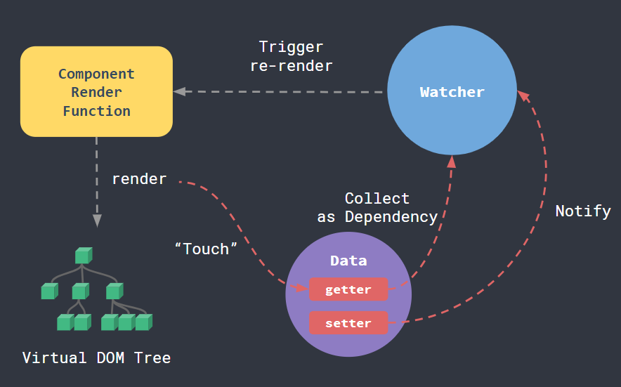

# Vue之渲染函数
## 渲染函数 Render Function的本质是返回虚拟DOM，然后根据虚拟DOM生成真实DOM
## 初始化阶段
* 模板 Template   
   * 编译为渲染函数
   * 返回虚拟DOM
   * 生成真实DOM
  
## 更新阶段
* 渲染函数 Render Function
   * 返回新的虚拟DOM
   * 通过diff算法进行更新
   * 应用到真实DOM上 

## 渲染循环
* 每个组件都维持着自身的渲染循环，通过一个观察者函数Watcher，来收集依赖和通知数据更新。
* 通过重写getter和setter方法来实现
* 核心API，Object.defineProperty()

